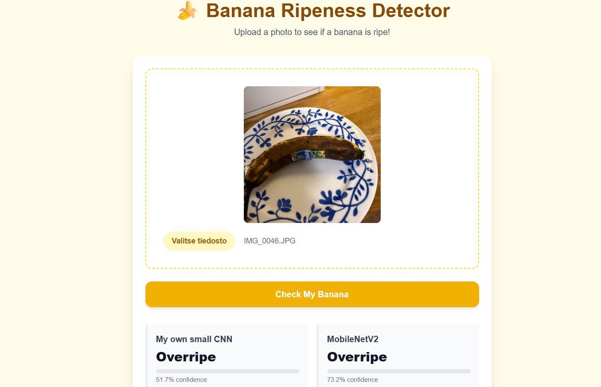
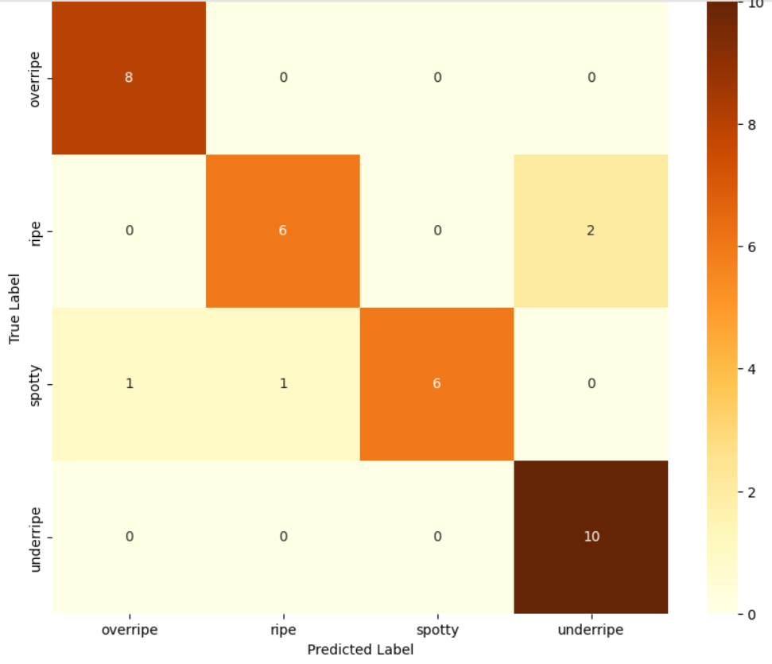
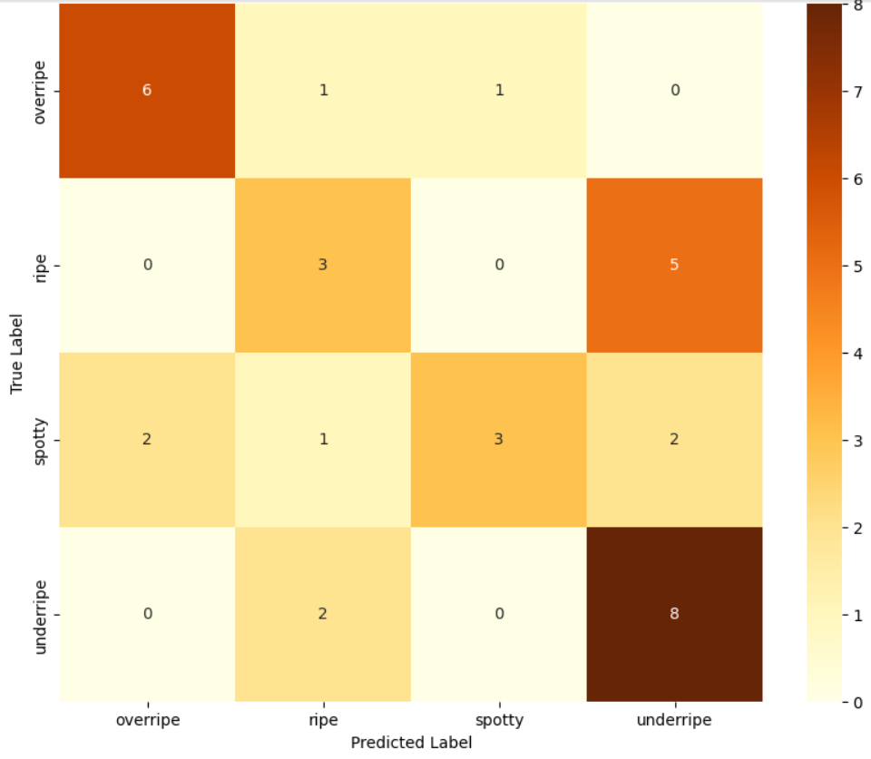

# Banana Ripometer: End-to-End Image Classification


> ### 🚀 **Quick Links & Live Demo**
> <table>
>   <tr>
>     <td align="center" width="200">
>       <a href="https://banana-project-frontend.onrender.com/">
>         
>       </a>
>     </td>
>     <td align="center" width="200">
>       <a href="https://youtu.be/IBvfsqcrUNA">
>         
>       </a>
>     </td>
>   </tr>
> </table>
>

> **Note:** The web app is hosted on a free Render instance. Initial cold starts may take a couple of minutes.

---




---

## Overview

**Banana Ripometer** is a full-stack, end-to-end Machine Learning web application that predicts the ripeness stage of bananas using Computer Vision. 

The core goal of this project was to benchmark a custom-built Convolutional Neural Network (**BananaNet**) trained from scratch against a fine-tuned pre-trained backbone (**MobileNetV2**), demonstrating the dramatic impact of **Transfer Learning** on small-scale custom datasets:

- **MobileNetV2 (Fine-tuned):** `88.24%` Test Accuracy
- **BananaNet (Custom CNN):** `58.82%` Test Accuracy

This is a complete end-to-end engineering effort covering:
1. **Custom Data Acquisition & Preprocessing**
2. **Model Architecture & Training Workflows in PyTorch**
3. **Model Benchmarking & Evaluation**
4. **FastAPI Backend Service API with Docker Containerization**
5. **Interactive Next.js Frontend with TailwindCSS**

---

## Tech Stack

- **Machine Learning:** PyTorch, Torchvision, Scikit-learn, NumPy, Matplotlib, Seaborn
- **Backend API:** FastAPI, Uvicorn, Python 3.10
- **Frontend UI:** Next.js, React, TailwindCSS
- **Deployment & DevOps:** Docker (CPU-optimized PyTorch build), Render

---

## Dataset & Pipeline

### Data Acquisition
To avoid relying on clean synthetic datasets, a custom dataset of **188 photos** was collected in real-world conditions:
- **4 Target Classes:** `Underripe`, `Ripe`, `Spotty`, `Overripe`.
- **Environmental Variance:** Photos taken under direct sunlight, kitchen LED lights, low ambient lighting, and diverse backgrounds (countertops, wooden surfaces, plates) to prevent shortcuts/background bias.
- **Multiple Objects:** Photos included single bananas as well as bunches with matching ripeness.

### Train / Validation / Test Splits
To ensure reliable evaluation, validation and test sets were strictly class-balanced, while training reflected real-world acquisition variance. Final evaluation was performed exclusively on unseen test data.

| Split | Underripe | Ripe | Spotty | Overripe | Total |
| :--- | :---: | :---: | :---: | :---: | :---: |
| **Train** | 49 | 50 | 22 | 17 | **138** |
| **Validation** | 10 | 8 | 8 | 8 | **34** |
| **Test** | 10 | 8 | 8 | 8 | **34** |

### Data Preprocessing & Augmentation
- **Geometry:** Resized to standard $224 \times 224$ dimensions.
- **Normalization:** Applied ImageNet statistics ($\mu=[0.485, 0.456, 0.406]$, $\sigma=[0.229, 0.224, 0.225]$) to align with MobileNetV2 pre-trained weights.
- **Augmentation:** Applied `RandomHorizontalFlip` to training batches to reduce overfitting.

---

## 🤖 Models & Evaluation

Both models were trained using the **Cross-Entropy Loss** criterion and the **Adam** optimizer. Early stopping checkpoints were saved based on peak Validation Accuracy to prevent overfitting.

### 1. Fine-Tuned MobileNetV2 (Transfer Learning)
- **Architecture:** Pre-trained MobileNetV2 backbone (frozen feature extractor) with a customized linear head to predict the 4 classes (`1280 -> 4`).
- **Learning Rate:** `0.003` | **Epochs:** `12`
- **Test Accuracy:** **`88.24%`**



---

### 2. Custom CNN (BananaNet)
- **Architecture:** Lightweight 2-layer ConvNet (`3 -> 16 -> 32` channels with MaxPool) + fully-connected linear layers (`32 * 56 * 56 -> 128 -> 4`) with `0.5` Dropout.
- **Learning Rate:** `0.001` | **Epochs:** `20`
- **Test Accuracy:** **`58.82%`**



### Key Takeaways
**Key Takeaway:** Transfer learning with MobileNetV2 significantly outperformed the custom CNN (`88.24%` vs `58.82%`) on the exact same dataset splits.  

**Transfer Learning Efficiency:** MobileNetV2 leverages pre-trained low-level feature extractors (edges, textures, color gradients) learned from ImageNet, allowing it to generalize well despite the small dataset ($N=138$ training images).

**Custom Architecture Limitations:** `BananaNet` lacked sufficient depth (only 2 convolutional layers) to build high-level abstract representations of ripeness patterns. 

---

## Repository Structure

```text
banana-ripometer/
├── data/                  # Dataset splits (train/val/test)
├── images/                # Screenshots & confusion matrix plots
├── saved_models/          # Model state dict checkpoints (.pth)
├── training/              # Jupyter Notebooks for model training
│   ├── custom_cnn.ipynb
│   └── mobilenet.ipynb
├── .gitignore
├── Dockerfile             # CPU-optimized Docker image build
├── main.py                # FastAPI REST endpoint (/predict, /)
├── model_loading.py       # Helper functions for PyTorch model initialization
├── requirements.txt       # Python dependencies
├── utils.py               # Image transformation pipeline
└── README.md